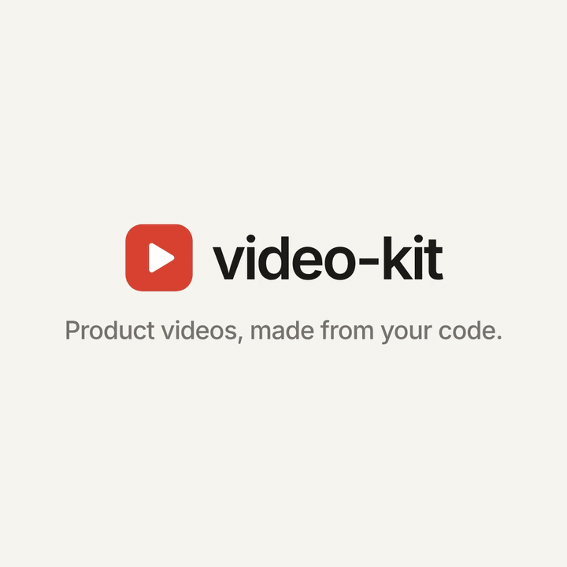
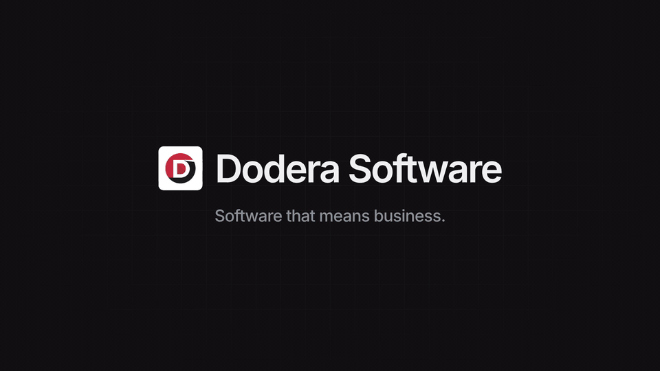

# video-kit

Launch videos, feature teasers, social clips and "what's new" videos for **your** product, made
by Claude from your product's own code, or just its website. No video editor and no design skills
needed: answer a few questions, approve a plan, and get a finished 4K video.

<table>
  <tr>
    <td width="42%" valign="top">
      <a href="https://github.com/Dodera-Software/claude-plugins/releases/download/video-kit-v0.8.1/video-kit-launch-1080p.mp4"></a>
      <br><sub><b>video-kit's own launch film</b>, made with video-kit (square, 64 s). <a href="https://github.com/Dodera-Software/claude-plugins/releases/download/video-kit-v0.8.1/video-kit-launch-1080p.mp4">Watch the full video</a></sub>
    </td>
    <td width="58%" valign="top">
      <a href="https://github.com/Dodera-Software/claude-plugins/releases/download/video-kit-v0.8.1/dodera-from-its-website-1080p.mp4"></a>
      <br><sub><b>Dodera Software</b>, made by <code>/video-kit:website doderasoft.com</code> from its website alone, in the technical look (wide, 47 s). <a href="https://github.com/Dodera-Software/claude-plugins/releases/download/video-kit-v0.8.1/dodera-from-its-website-1080p.mp4">Watch the full video</a></sub>
    </td>
  </tr>
</table>

## What you can ask for

```
/video-kit:make
```

Claude asks what kind of video (launch film, feature teaser, social clip), where it will be shown,
whether it's narrated, has sound effects or is silent (silent unless you ask), which feature or story, how it should look, which
languages, and whether to show the product recreated from its code, as the real app (screenshots and
short recordings) or through screen recordings you made. Then it
reads how your product works, comes up with an idea for this video, shows you the plan and a few
still images to approve, and makes the video.

**Every video is its own.** Four looks change the whole feel: calm and elegant, bold (your brand
colour fills the screen), technical (dark, for developer tools) and playful. Claude builds each
video around its own idea and one moment only your product could have, from a wide range of
scenes (numbers counting up, words swapping, a typing terminal, before and after, a wall of
screens, step-by-step, quotes, a flight through your screens, your logo in 3D…), so no two videos
look alike.

**Scene by scene, or like a film.** Most videos go scene by scene, each with its own point. Ask
for something cinematic (or let Claude choose it) and you get a film instead: one continuous camera
journey through your product's screens, words appearing over the picture like subtitles, and
your logo as a solid 3D object at the end.

**Describe it yourself if you like:** "open on our logo drawing itself, then show the three
dashboards side by side" and it builds exactly that.

```
/video-kit:make 20-second teaser for the new export feature, playful, for LinkedIn
```

With a description, it only asks what's missing.

```
/video-kit:website acme.com
```

**No code? Just a website.** Give it a product's website (or run it without one and it asks). It
reads the colours, logo, fonts and wording from there, takes clean screenshots of the pages
(cookie notices hidden), and makes the video from what the site says. Works from any folder; the
video goes in a `video` folder there. Use it for your own website, or one whose owner has agreed:
the logo, wording and screenshots in the video belong to them.

```
/video-kit:voiceover
```

**A narrator's voice**, for a video you already made or a new one. Claude writes a line for each
scene, lets you hear a few voices and pick one, and the video is timed to the voice. The voices
are free and open and are recorded on your computer: no account, nothing uploaded. English only
(American and British voices).

```
/video-kit:changelog
```

A 15–30 second "what's new" video from your recent changes: Claude finds what users will notice,
checks each change in the code, and lets you pick which ones to show.

You get:

- the video in 4K (website, YouTube) and 1080p (LinkedIn, Slack, email),
- a cover image and a YouTube thumbnail; every video opens on a cover, so Slack and LinkedIn show
  a proper preview,
- one video per language you asked for.

Give notes like a director ("this part is too fast", "make the ending punchier") and it redoes them.

## Install

In Claude Code:

```
/plugin install video-kit --marketplace Dodera-Software/claude-plugins
```

Confirm adding the marketplace, then choose **Install for you** to have it in every project, in the
terminal, VS Code and the desktop app. On Claude Code older than v2.1.275, run
`/plugin marketplace add Dodera-Software/claude-plugins` first, then `/plugin install video-kit@dodera`.

**Stay up to date:** turn on automatic updates once: type `/plugin`, open **Marketplaces**, choose
**dodera**, then **Enable auto-update**. New versions then install by themselves; Claude Code tells
you when one arrives. Without it, the plugin mentions a newer version when you use it, and you
update from `/plugin` → Installed → video-kit → Update now. What's new in each version:
[releases](https://github.com/Dodera-Software/claude-plugins/releases).

**Where it works:** Claude Code (the terminal, the IDE extensions and the desktop app's Code tab),
because making a video runs programs on your computer. In the claude.ai chat, the mobile app and
Cowork it can plan a video but not make it.

**You'll need** a Mac or a Windows PC (or Linux with Docker running), with
[Node.js](https://nodejs.org) (the LTS version) and
[Docker Desktop](https://www.docker.com/products/docker-desktop) installed. Claude
checks for both before starting and tells you if one is missing. After installing Docker Desktop,
open it once and accept its terms; from then on it doesn't need to be open: Claude opens it when
it makes a video and leaves it open. Keep about 5 GB of disk space free.

**Your first video takes 5–10 minutes longer.** The first time on a computer, Claude sets up the
video app (a one-time download of about 3 GB). It does this in the background while it reads your
product, and tells you when it starts. After that, a video starts straight away.

## The real app, and your own recordings (optional)

By default the product is recreated from its code, so nothing needs to run. If you choose the real
app instead:

- Claude starts your product on your computer the way developers run it (with its database and
  example data), takes screenshots, films short recordings of the moments where something moves
  (typing, a card moving, a list filling up), and closes it again. It reads your project to learn how.
- If pages need a login, you give it a **demo account**, never a real one.
- **Everything on screen ends up in the video**, so only example data should be visible.

You can also bring screen recordings you made yourself (on a Mac, Windows or your phone): put them
in the project or tell Claude where they are, and it builds the video around them.

## What leaves your computer

- **Your code and your videos stay on your computer.** The plugin sends nothing anywhere: no
  accounts, no analytics, no uploads. Claude reads your project the same way it does in any Claude
  Code session.
- **What it downloads:** the video app the first time (from npm and Docker Hub, and the browser it
  draws with), the fonts from Google Fonts while making the video, the voices the first time you
  choose a narrator (about 90 MB, from Hugging Face; shared with pr-podcast), and, once per video,
  the plugin's version number from GitHub to tell you about updates.
- **In website mode** it visits the pages it reads, like a browser would, and downloads a public
  list of cookie notices to hide them.
- **Real screenshots and recordings** run your product on your computer only. The demo login is
  passed while they are taken and never written to a file.

## If something goes wrong

Claude explains problems in plain words as they happen. The common ones:

| What you see | What to do |
| --- | --- |
| "Docker did not start" | Open Docker Desktop once yourself, accept its terms, wait until it says it's running, then ask Claude to try again. |
| It stops with "no space left" | Free up about 5 GB of disk space and ask Claude to try again. |
| A website "blocks" the screenshots | Some sites turn automated visitors away. Choose "Simple animated scenes" instead of screenshots, or give Claude screenshots you took yourself. |
| Text goes by too fast, or a scene is wrong | Say so like you would to a video editor ("scene 3 is too fast", "use our green, not the blue"); Claude redoes that part. |
| No update shows up in `/plugin` | Type `/plugin marketplace update dodera`, then update video-kit from `/plugin` → Installed. |

Something else? [Open an issue](https://github.com/Dodera-Software/claude-plugins/issues) with what
you asked for and what Claude said.

## Removing it

Type `/plugin uninstall video-kit@dodera`. Then ask Claude "remove the video-kit
video app from Docker" to free its 3 GB (or delete the `video-kit` image in Docker Desktop →
Images). Your videos stay in each project's `video` folder until you delete it.

## For developers

- **Where things go:** a `video/` folder in your project (Remotion, its own `package.json`),
  kept out of your linter, build and Docker context. `video/out/` and `video/node_modules/` are
  git-ignored. See `video/README.md` for the commands.
- **Rendering** runs in Docker, so no browser is installed on your machine. The render image is
  about 2.7 GB, shared by every project on the same kit version; older versions are removed
  automatically when a new one is built.
- **Release videos on every release:** copy `skills/changelog/release-video.yml` to
  `.github/workflows/` and add an `ANTHROPIC_API_KEY` repository secret. Each run uses that key's
  credits.
- **Try it without installing:** clone `Dodera-Software/claude-plugins` and start Claude Code in your
  project with `claude --plugin-dir /path/to/claude-plugins/plugins/video-kit`.

### Try the example

From a clone of `Dodera-Software/claude-plugins`:

```bash
cp -r plugins/video-kit/skills/make/template /tmp/video && cd /tmp/video && npm install
./render.sh AcmeTeaser-en       # a 19-second teaser for a made-up product → out/ (also AcmeTeaser-es)
npm run studio                  # or preview it live with a timeline
```

## Licences

- This plugin: MIT.
- Sound effects: CC0 (Kenney, "Interface Sounds"). No music is included.
- Voices: Kokoro (Apache 2.0), free for commercial videos.
- **Remotion** has its own licence: free for individuals and companies of up to three people;
  larger companies need a [Remotion company licence](https://www.remotion.pro/license) to render.
- **Docker Desktop** is free for personal use, education and companies with fewer than 250
  employees and under $10 million in yearly revenue; larger companies need a
  [paid Docker subscription](https://www.docker.com/pricing/).
